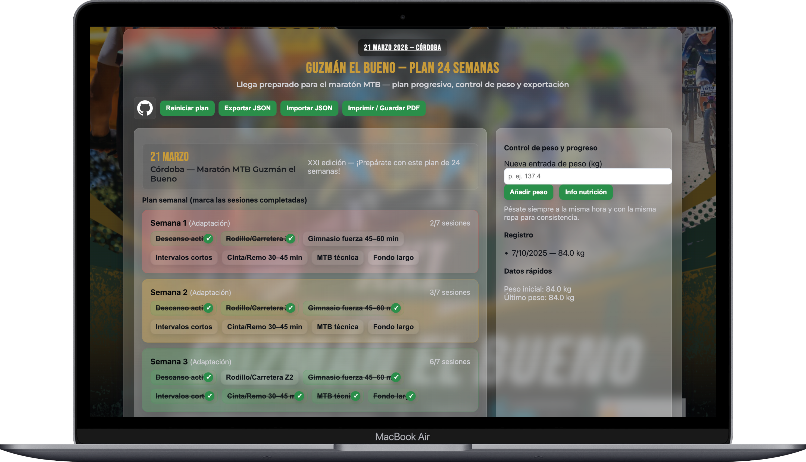
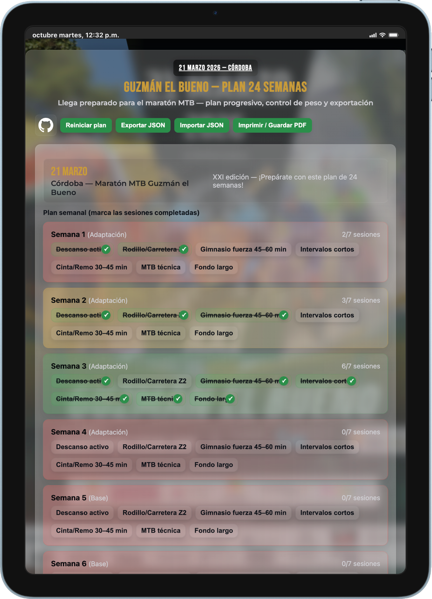
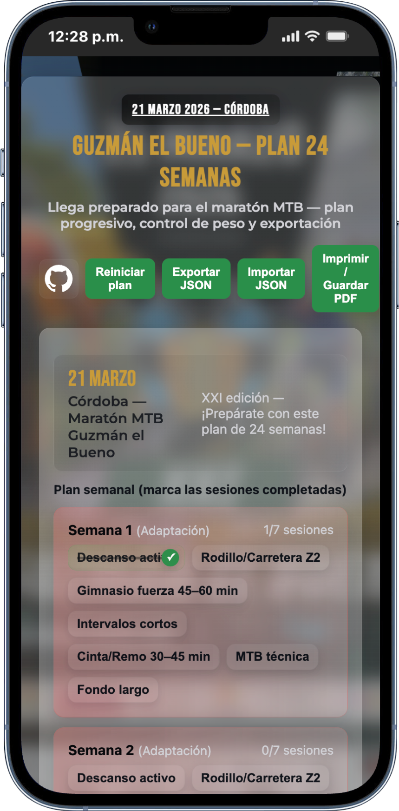

# 🏔️ Plan 24 Semanas — MTB Guzmán el Bueno 2026

Este proyecto contiene un plan de entrenamiento de **24 semanas** diseñado para preparar la participación en la **MTB Guzmán el Bueno 2026**, con el objetivo de disfrutar y completar la prueba con garantías de manera saludable.

---
## 📋 Descripción general

El plan está dividido en **5 fases progresivas**:

| Fase | Semanas | Objetivo principal |
|------|----------|--------------------|
| Adaptación | 1–4 | Reacondicionar el cuerpo, ganar constancia y mejorar movilidad. |
| Base aeróbica | 5–10 | Desarrollar capacidad aeróbica y control de zonas de esfuerzo. |
| Fuerza / MTB | 11–16 | Introducir trabajo de fuerza y técnica específica en MTB. |
| Específica | 17–22 | Simular condiciones de carrera, trabajar potencia y gestión del esfuerzo. |
| Puesta a punto | 23–24 | Reducir carga y optimizar sensaciones antes del evento. |

Cada semana incluye **7 sesiones planificadas** entre ciclismo, fuerza, técnica y descanso activo.

---

## 🚴‍♂️ Tipos de sesión

| Sesión | Descripción breve |
|---------|------------------|
| **Descanso activo** | Caminata ligera o rodillo suave, movilidad y estiramientos. |
| **Rodillo / Carretera Z2** | Base aeróbica, ritmo cómodo y constante. |
| **Gimnasio fuerza** | Trabajo de fuerza general: piernas, core y técnica. |
| **Intervalos cortos** | Series de alta intensidad controlada (Z4–Z5). |
| **Cinta / Remo** | Entrenamiento cruzado para mantener volumen sin impacto. |
| **MTB técnica** | Práctica de habilidades específicas: curvas, tracción, subidas. |
| **Fondo largo** | Salidas largas para trabajar resistencia, nutrición y pacing. |

---

## 💡 Cómo usar el plan

1. Abre el archivo `plan-mtb-guzman.html` en tu navegador.
2. Marca cada sesión como **completada** al terminarla (los datos se guardan automáticamente en tu navegador).
3. Registra tu **peso semanal** en el panel lateral para seguir el progreso.
4. Puedes **exportar o importar tu progreso** en formato JSON.
5. Usa el botón **“Imprimir / Guardar PDF”** para generar un informe o registro de tu avance.

---

## 📦 Características técnicas

- **HTML, CSS y JavaScript puro**, sin dependencias externas.
- Guarda automáticamente el progreso usando `localStorage`.
- Permite:
  - Marcar sesiones completadas ✅  
  - Registrar y visualizar peso corporal ⚖️  
  - Exportar / importar estado del plan 📂  
  - Generar PDF de resumen 🧾  
  - Consultar descripciones detalladas mediante popups 💬  

---

## 🧱 Estructura del proyecto

 mtb-guzman-2026/
├── plan-mtb-guzman.html # Aplicación interactiva del plan
└── README.md # Este archivo de documentación

---

##  Recomendaciones

- Pésate siempre a la misma hora y con la misma ropa.
- Realiza los entrenamientos de calidad descansado y bien alimentado.
- Prioriza la **consistencia** antes que la intensidad.
- Ajusta las cargas según tu estado físico y recuperación.
- No dudes en sustituir una sesión exigente por descanso si lo necesitas.

---

##  Créditos

Existe un Gist para poder copiarlo y utilizar el codigo sin problemas.

https://gist.github.com/chelemovil87/c9b2c87cb01d5a265e5423a1b461f97d

---

###  ¡A disfrutar del camino y llegar fuerte a la Guzmán el Bueno 2026!